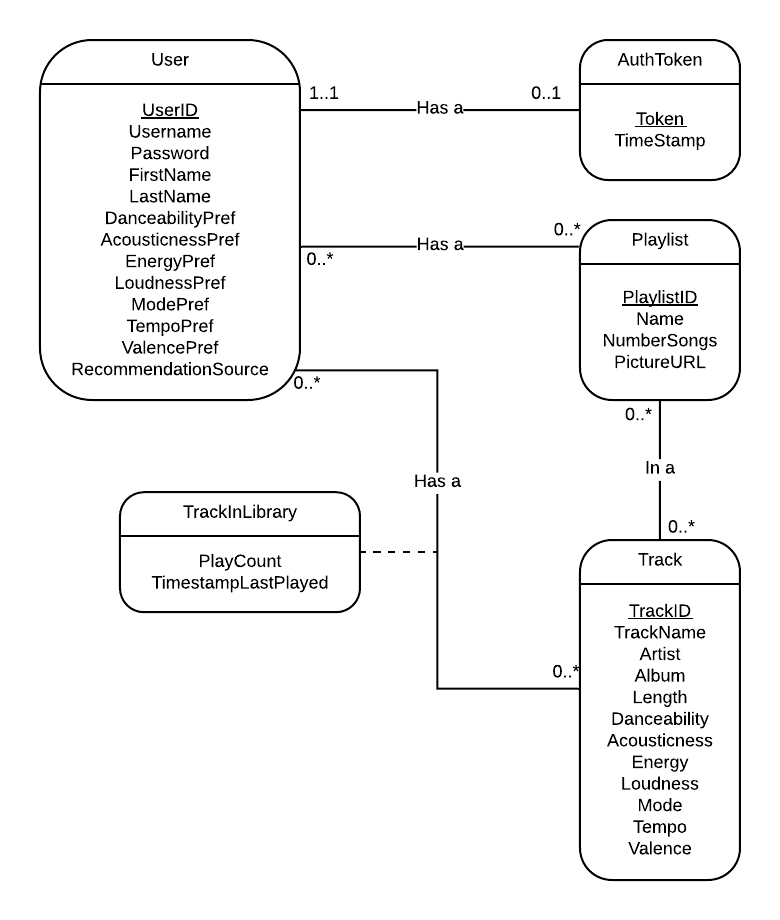

# Schema
This is a conceptual model of the project.

Below are the different tables that will be created to implement the model.

## User
Holds the user’s login information and the user’s preferences in music. The preferences variables are used by Spotify to rate songs.

> User(userID, username, password, firstName, lastName, danceabilityPref, accousticnessPref, energyPref, loudnessPref, modePref, tempoPref, valencePref, recommendationSource)

## AuthToken
Holds the authorization tokens needed to access the Spotify API for the user’s music data.

> AuthToken(token, userID, timeStamp)
>    * Foreign Key userID references User

## Playlist
Holds all of the user’s playlists, along with the information of the playlist such as: its name, number of songs, and a picture URL given in the Spotify API

> Playlist(playlistID, userID, name, numberSongs, pictureURL)
>    * Foreign Key userID references User

## Track
This table holds the specific information for each track.  It holds the trackID, the name of the track, the artist on the track, album that the track is from, the length of the track, and the rankings of its sound that Spotify has given it (danceability, acousticness, energy...)

> Track(trackID, trackName, artist, album, length, danceability, accousticness, energy, loudness, mode, tempo, valence)

## UserLibrary
This table holds all of the user’s songs, along with their trackID and what playlists they are in.  A track could be listed multiple times in this table to account for if it is in different playlists.

> UserLibrary(userID, trackID, playlistID)
>    * Foreign Key userID references User
>    * Foreign Key trackID references Track
>    * Foreign Key playlistID references Playlist
